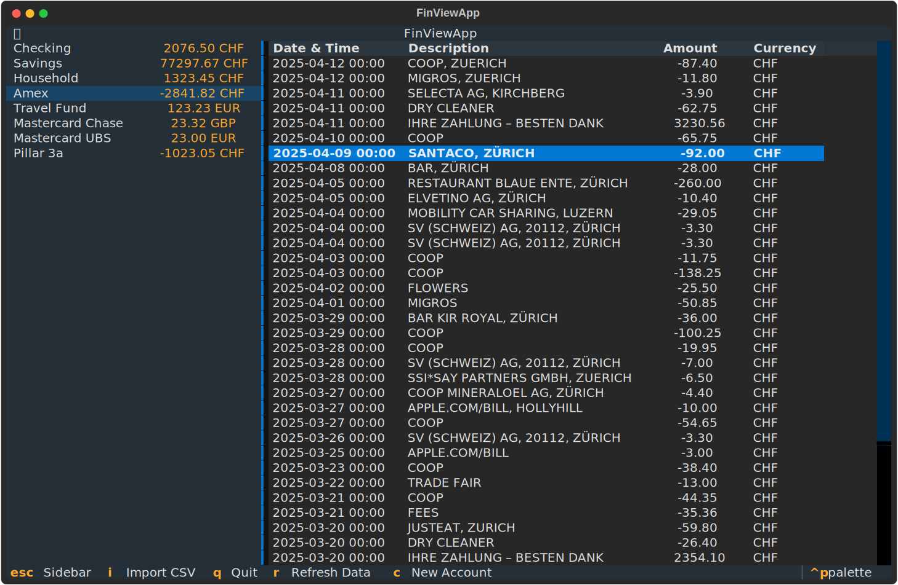

# FinView

FinView is a lightweight, terminal-based personal finance tracker. It allows you to manage accounts, view transaction histories, and import data from various bank CSV exports using a flexible CEL-based mapping system.



---

## How to Use

1. **Install dependencies**:
```bash
pip install -r requirements.txt

```


2. **Run the application**:
```bash
python main.py [database]
```
If a database path is provided, FinView opens (or creates) that file. Without one, it starts with a pure in-memory database. Use `--version` or `--license` for version/license info.


3. **Basic Controls**:
* `c`: Create a new account
* `i`: Import a CSV file (when an account with a mapping spec is selected)
* `r`: Refresh data
* `Enter`: Toggle reviewed status on selected transaction
* `s`: Split a transaction
* `m`: Merge transactions
* `j` / `k`: Move cursor down / up
* `g` / `G`: Jump to first / last row
* `/`: Search transactions
* `n` / `N`: Next / previous search match
* `Escape`: Return focus to sidebar
* `:q`: Quit (`:wq` to save and quit, `:q!` to discard changes)

---

## Testing

Run the test suite with:

```bash
python -m pytest tests/ -v
```

Tests cover all layers: domain models, the CSV importer engine, the database layer, and headless TUI tests using Textual's `run_test()` framework. They use an in-memory SQLite database so no files or external setup are needed.

---

## Mapping YAMLs

FinView uses YAML files that describe how rows from your bank's CSV map to the internal database format. These files use [**CEL (Common Expression Language)**](https://cel.dev) to define the logic

### Structure

Each YAML must follow this schema:

* **`version`**: Schema version (e.g., "1.0")
* **`name`**: A friendly name for the bank/importer
* **`parser`**: Defines the `delimiter` (usually `,` or `;`) and how many `skip_rows` (headers) to ignore
* **`mappings`**: CEL expressions to extract data from the `row` list:
    * `timestamp`: Must result in a `YYYY-MM-DD` string
    * `description`: Transaction text
    * `amount_original`: The numerical value
    * `currency_original`: The currency code
    * `amount_in_account_currency`: The value converted to your account's base currency


### Example

```yaml
name: My Bank
parser:
  delimiter: ","
  skip_rows: 1
mappings:
  timestamp: "split(row[0], '.')[2] + '-' + split(row[0], '.')[1] + '-' + split(row[0], '.')[0]"
  description: "row[1]"
  amount_original: "double(row[2])"
  currency_original: "'USD'"
  amount_in_account_currency: "double(row[2])"

```

### Adding a New Mapping

1. Create a new `.yaml` file inside the `importers/` directory (or a subdirectory)
2. Define the logic based on your bank's CSV column order (e.g., `row[0]` is the first column)
3. Restart FinView; the new mapping will automatically appear in the "Import Mapping Spec" dropdown when creating or editing an account

---

## License

Copyright (C) 2026 Philipp Heller

This program is free software: you can redistribute it and/or modify it under the terms of the **GNU General Public License v3** as published by the Free Software Foundation. This program is distributed **without any warranty**; see [LICENSE.md](LICENSE.md) for the full license text.